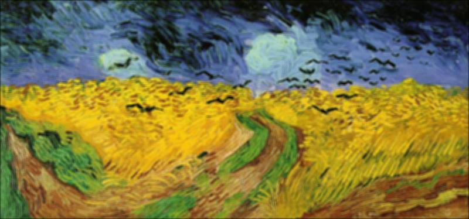
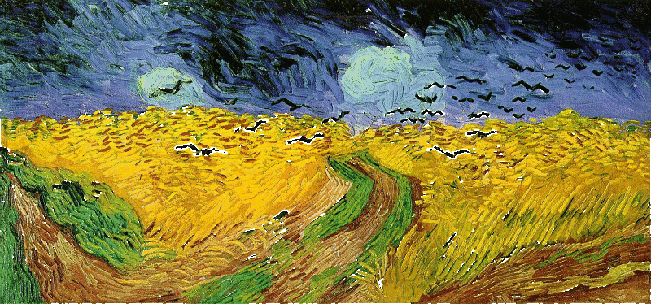
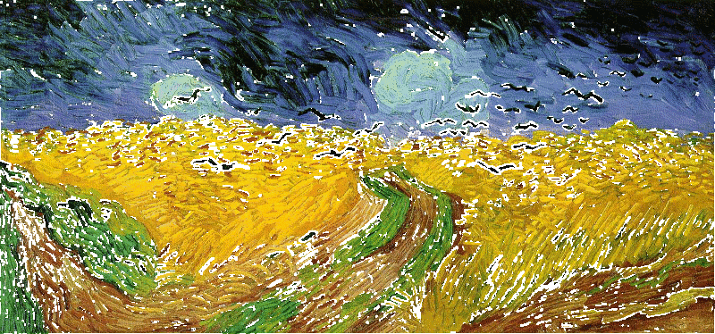
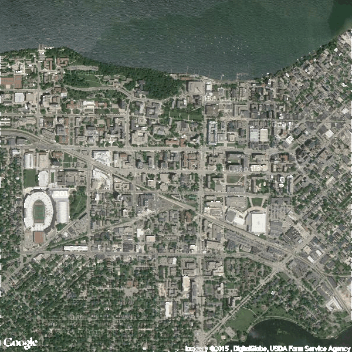
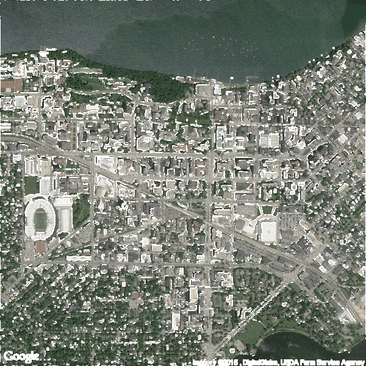

mail : <dcao28@wisc.edu>


*read data and set functions*  

```{r}
if (!require("png")) {
  install.packages("png")
  stopifnot(require("png"))
}

vg <- readPNG("Van_Gogh.png")
madison <- readPNG("Madison.png")

library(parallel)

#padding 
padMat <- function(mat,k){# to pad a matrix
  pad.Mat <- matrix(0, dim(mat)[1]+2*k, dim(mat)[2]+2*k)
  pad.Mat[(k+1):(dim(mat)[1]+k), (k+1):(dim(mat)[2]+k)] <- mat
  return(pad.Mat)
}

mfilter <- function(m,k,cores=2){# carry out the mean filter
  padM <- padMat(mat = m,k = k)
  r<-dim(padM)[1]
  c<-dim(padM)[2]
  mf<-mcmapply(FUN = function(r,c) mean(padM[(r-k):(r+k),(c-k):(c+k)])
           , row(padM)[(k+1):(r-k), (k+1):(c-k)]
           , col(padM)[(k+1):(r-k), (k+1):(c-k)]
           , mc.cores = cores)
  return(matrix(mf,r-2*k))
}
```

# 1.Smoothing  

## k=1

```{r}
k=1
mf<-mclapply(1:3,function(x,k,cores) mfilter(vg[,,x],k=k,cores=cores),cores = 4,k=k)

z <- array( NA, dim= dim(vg))
for(i in seq(3)){
  z[,,i] <- mf[[i]]
}
writePNG(z,target = "van_k1.png")
```


## k=2

```{r}
k=2
mf<-mclapply(1:3,function(x,k,cores) mfilter(vg[,,x],k=k,cores=cores),cores = 4,k=k)

z <- array( NA, dim= dim(vg))
for(i in seq(3)){
  z[,,i] <- mf[[i]]
}
writePNG(z,target = "van_k2.png")
```



## k=3

```{r}
k=3
mf<-mclapply(1:3,function(x,k,cores) mfilter(vg[,,x],k=k,cores=cores),cores = 4,k=k)

z <- array( NA, dim= dim(vg))
for(i in seq(3)){
  z[,,i] <- mf[[i]]
}
writePNG(z,target = "van_k3.png")
```


# 2.edge detecting 

I choose red channel to detect edge.  

```{r}
edgedetect <- function(m,k,cores=2,p){
  padM <- padMat(mat = m,k = k)
  r<-dim(padM)[1]
  c<-dim(padM)[2]
  mf<-mcmapply(FUN = function(r,c) sd(padM[(r-k):(r+k),(c-k):(c+k)])
           , row(padM)[(k+1):(r-k), (k+1):(c-k)]
           , col(padM)[(k+1):(r-k), (k+1):(c-k)]
           , mc.cores = cores)
  mf <- matrix(mf,r-2*k)
  
  return(mf>quantile(mf,probs = p))
}
red.vg <- vg[,,1]

```


## k=1;p=0.99  

```{r}
k=1;p=0.99
edge.finding <- edgedetect(m = red.vg,cores = 4,k = k,p = p)
edge.white <- lapply(1:3,function(x) {vg[,,x][edge.finding] <- 1;return(vg[,,x])})

z <- array( NA, dim= dim(vg))
for(i in seq(3)){
  z[,,i] <- edge.white[[i]]
}
writePNG(z,target = "van_edge99%.png")
```



## k=1;p=0.90 

```{r}
k=1;p=0.90
edge.finding <- edgedetect(m = red.vg,cores = 4,k = k,p = p)
edge.white <- lapply(1:3,function(x) {vg[,,x][edge.finding] <- 1;return(vg[,,x])})

z <- array( NA, dim= dim(vg))
for(i in seq(3)){
  z[,,i] <- edge.white[[i]]
}
writePNG(z,target = "van_edge90%.png")
```




> the highlight pixels are the deep colored things like the birds and some green grass and brown roads.


## k=1;p=0.99  

```{r}
k=1;p=0.99
red.mad <- madison[,,1]

edge.finding <- edgedetect(m = red.mad,cores = 4,k = k,p = p)
edge.white <- lapply(1:3,function(x) {madison[,,x][edge.finding] <- 1;return(madison[,,x])})

z <- array( NA, dim= dim(madison))
for(i in seq(3)){
  z[,,i] <- edge.white[[i]]
}
writePNG(z,target = "madison_edge99%.png")
```



## k=1;p=0.90 

```{r}
k=1;p=0.90
edge.finding <- edgedetect(m = red.mad,cores = 4,k = k,p = p)
edge.white <- lapply(1:3,function(x) {madison[,,x][edge.finding] <- 1;return(madison[,,x])})

z <- array( NA, dim= dim(madison))
for(i in seq(3)){
  z[,,i] <- edge.white[[i]]
}
writePNG(z,target = "madison_edge90%.png")

```



> the feature of the edge detecting result is that the coutour of the building is highlightened. It is easy to understand, because the space around the building is right the streets and roads.    


